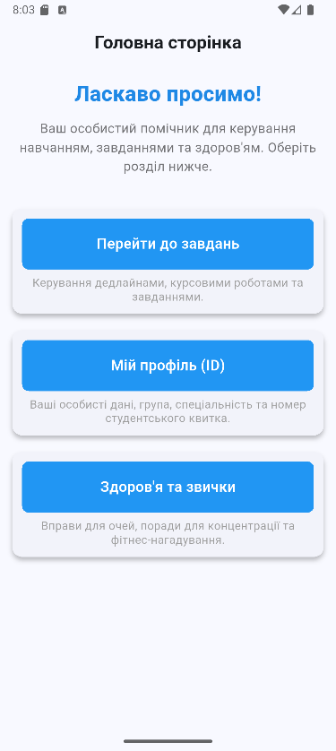
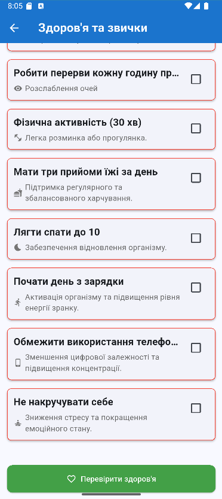

# Про додаток
Простий додаток, що дозволяє створити список завдань з дедлайнами та вивести інформацію
## Функціонал
- Отримання даних через API.
- Створення та видалення завдань з дедлайнами.
- Відображення інформації про користувача, що бува введена ним.
- Перевірка кількості виконаних за день здорових звичок.
## Встановлення
1. Клонуйте репозиторій: `git clone
https://github.com/DmytroYeDm/task_mist.git`
2. Відкрийте проєкт у Android Studio або Xcode.
3. Запустіть емулятор або підключіть пристрій.
## Скріншоти

